# Marketing Cockpit Template

**Your marketing department, running inside Claude Code, on a brand your agents can read, apply and check.**

54 production skills · 20 specialist agents · 120 slide layouts · 44 landing sections · 16 ready-to-open page templates · 8 optional modules. Built and battle-tested by [Jessy Martin](https://jessem.fr) on real client accounts, then open-sourced.

[](LICENSE)
[](https://docs.anthropic.com/en/docs/claude-code/overview)
[](#whats-inside)
[](#whats-inside)

Clone it once per company, run the wizard, and get a role-based cockpit that operates like a marketing director: strategy, social, email, landing pages, design, presentations, SEO, plus optional modules for video, n8n automation, client-facing reporting, outbound acquisition and print production. Every deliverable is a file in your repo. Every word passes a brand gate before it ships.

---

## The brand brain

Everything in the cockpit starts from a **brand brain**: your brand stored in files that an AI agent can read, apply and check. A brand guide written for people says "warm but expert" and counts on a designer who has seen your last campaigns and knows what you refused. An agent only has the sentence, and fills the rest with the average of everything it has read. The brand brain replaces that guesswork with files (one rule in one place, read in a set order per deliverable) and with scripts that stop the mechanical mistakes before anyone reviews the draft.

It holds in four layers, from the most measurable to the one that needs the most human judgment:

| Layer | What it holds | Files | Checked by |
|---|---|---|---|
| **1. Tokens** | Colours, typefaces, logo, radii, spacing: everything that can be measured | `01-brand/tokens.json` (DTCG design tokens) and `01-brand/style-guide.md` (intent, spacing, logo rules, generated CSS appendix) | `scripts/build-tokens.py --check`: every generated CSS file matches the tokens · `scripts/lint-brand.py`: off-palette colours (ΔE tolerance), off-brand fonts · `06-graphic-design/scripts/qa-visuel.py`: rendered colours, fonts, type floors, contrast, logo clear space · the deck QA `06-graphic-design/presentations/scripts/qa.py` |
| **2. Voice and blacklist** | Identity, audiences, tone, refused words | `01-brand/voice.md`, `messaging-framework.md` (central message, sourced key numbers), `personas.md`, `anti-ai-writing-style.md` | `scripts/lint-brand.py`: banned vocabulary, em dashes, final period on titles, hashtags, unresolved placeholders, negative parallelisms · the `brand-check` gate: its step 0 runs the linter, then it judges tone, proof (every number traced to `messaging-framework.md` or a citation) and audience |
| **3. Examples** | What was approved, what was refused and why | `01-brand/assets/` and its catalogue [`index.md`](01-brand/assets/index.md), `01-brand/exemples-rejetes.md` (rejected examples: excerpt, reason, rule, fix), the per-channel archives indexed in `_templates/inventory.md`, the fictional starter corpus `_examples/` | `scripts/build-inventory.py --check`: the anti-repetition index is complete · `brand-check` reads the rejection corpus and the last 90 days of the inventory, and logs every new refusal · then you |
| **4. Rights** | Licences, image rights, AI disclosure | `01-brand/droits.md` (rights register: fonts, third-party logos, people, AI-derived portraits), `01-brand/divulgation-ia.md` (AI disclosure policy) | `06-graphic-design/scripts/promote-asset.py`: no asset enters the library without source, rights and author · `06-graphic-design/scripts/genmeta.py`: provenance of generated images (model, prompt, sha256) · then you: an "à confirmer" status is an open question, never a permission |

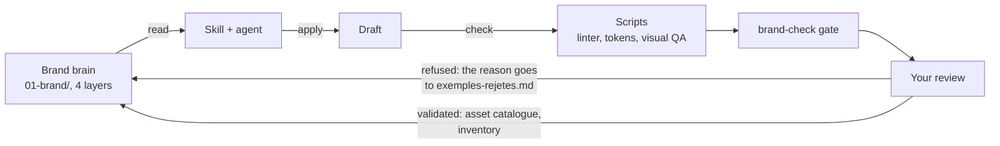
```mermaid
flowchart LR
    B["Brand brain<br/>01-brand/, 4 layers"] -->|read| S["Skill + agent"]
    S -->|apply| D["Draft"]
    D -->|check| L["Scripts<br/>linter, tokens, visual QA"]
    L --> G["brand-check gate"]
    G --> H["Your review"]
    H -->|"refused: the reason goes<br/>to exemples-rejetes.md"| B
    H -->|"validated: asset catalogue,<br/>inventory"| B
```

**How it is built.** `/brand-discover` (run by `/start-cockpit`) reads your website, recent posts and any brand documents you drop in `_bootstrap/inputs/`, drafts each section, and writes nothing until you validate it. It never invents a value: a colour it cannot read, a number without a source, a rights status nobody knows becomes a question or a line in `01-brand/_gaps.md`. It then fills the layers from the templates in [`_templates/brand/`](_templates/brand/), copies your banned words into `scripts/lint-brand.toml` and runs `build-tokens.py`.

**How it keeps learning.** Every draft blocked on form or voice adds an entry to `exemples-rejetes.md` (step 5 of `brand-check`), every validated asset enters the catalogue through `promote-asset.py`, every delivery adds a line to the inventory, and a word you keep correcting goes into `voice.md` and the linter config, so the script catches it next time. The next production reads all of it.

**Why it matters.** An agent applies the rules it can read, and a script can verify the ones that can be measured. Layers 1 and 2 are mostly enforced mechanically (the PostToolUse hook runs the linter on every write in a production folder), so your review goes where judgment is needed: which example deserves to be copied, which refusal teaches something, what you have the right to publish. The brain is plain Markdown and JSON in your own copy of the repo, loaded per task: the task router in [`01-brand/CLAUDE.md`](01-brand/CLAUDE.md) tells the agent which files a post, a visual, a deck or a web page needs, in which order, and nothing more.

Want to build yours step by step, without a technical background? The Brand Brain workshop walks through it: [English](https://jessem.fr/en/ai-marketing-cockpit/workshops/brand-brain/) · [français](https://jessem.fr/cockpit-marketing/ateliers/cerveau-de-marque/).

---

## See it before you install it

Everything below ships in the template and opens in a browser with zero build step. The demo brands ("Meridian Conseil" across the demos, plus one invented brand per landing template) are 100% fictional; the wizard reskins everything with *your* tokens.


| Waterfall data-viz layout | Quote + portrait layout |
|---|---|
| 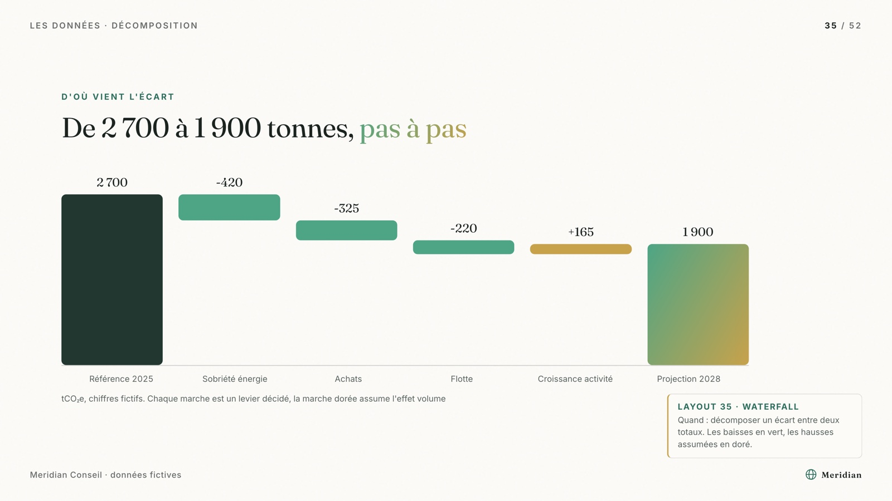 |  |

*Three of the 120 slide layouts, captured in full-screen presentation mode from the self-documenting catalogue (each slide carries its own usage note). 8 families: opening, editorial, dataviz, diagrams, tables, proof, closing, photography. The `slides` skill picks one layout per narrative beat, then rebuilds it with your brand tokens.*

| Landing pages (6 templates, 44 sections) | Interactive lead magnets (10 templates) |
|---|---|
| 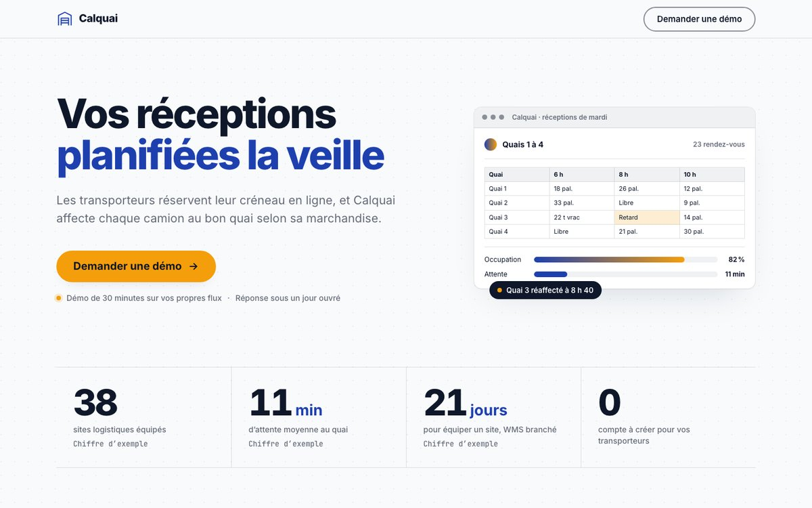 | 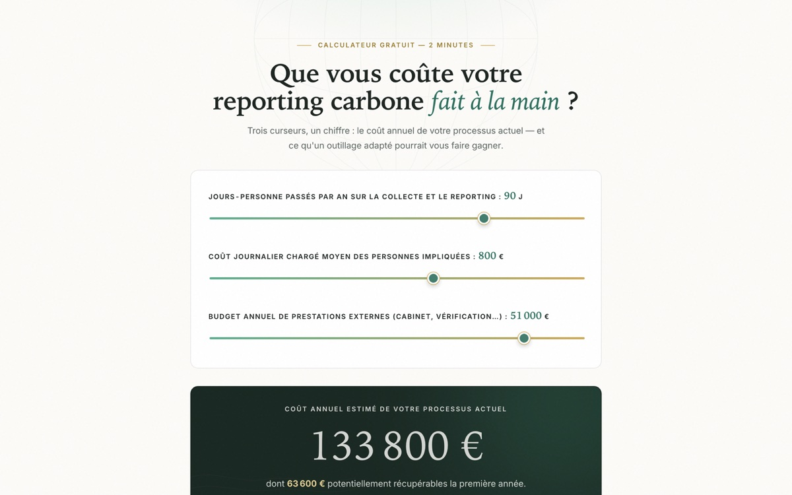 |
| 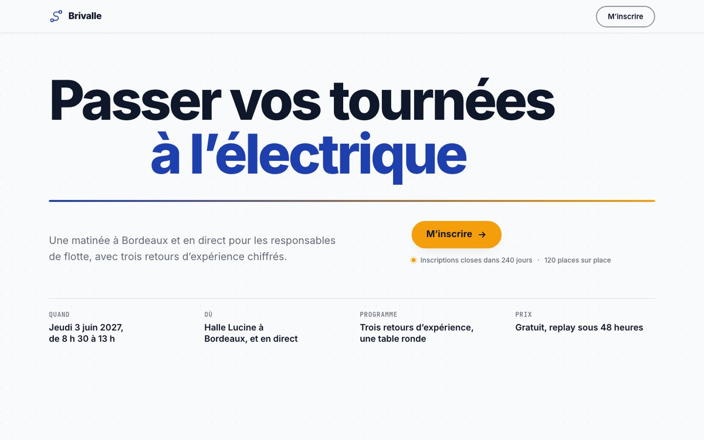 | 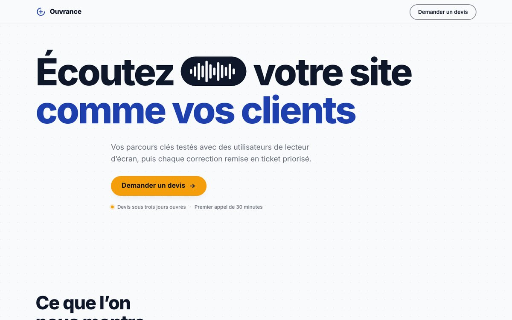 |


*The reporting module: a static, brand-styled dashboard deployed on the client's own site (plain FTP, access code, monthly JSON snapshots, written analysis). No SaaS subscription.*

*`/start-cockpit`: fetches your website, analyzes your content, drafts your brand brain for validation, wires your tools. 30–60 minutes.*

---

## Real results, real clients

Everything above uses the fictional demo brand. Everything below is real: this template is not a demo, it is the daily production tool of a working marketing practice, running several live brands. Click any link and check for yourself.

### Three live sites run with this cockpit

| [n2.help](https://n2.help) | [qiplim.com](https://qiplim.com) |
|---|---|
| 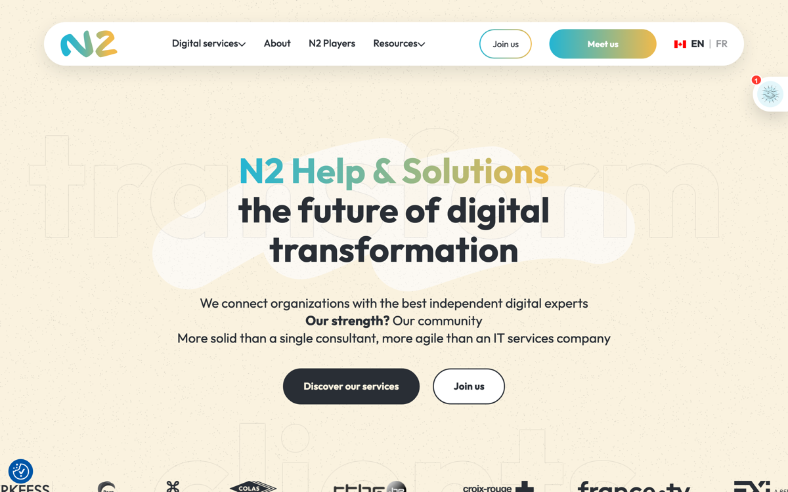 | 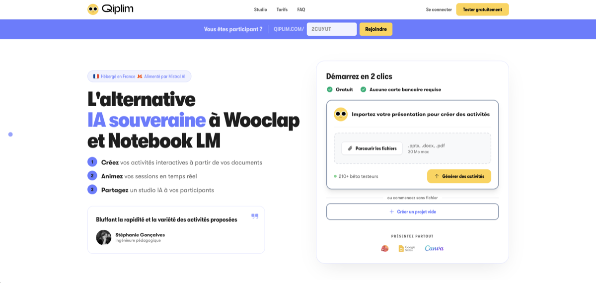 |
| *N2 Help & Solutions, B2B IT-services client: social content, carousels, newsletters and interactive resources produced with this system.* | *Qiplim, the maintainer's own SaaS: launch content, landing copy and brand visuals shipped with this system.* |

| [jessem.fr](https://jessem.fr) | [n2.help/resources](https://n2.help/resources) |
|---|---|
| 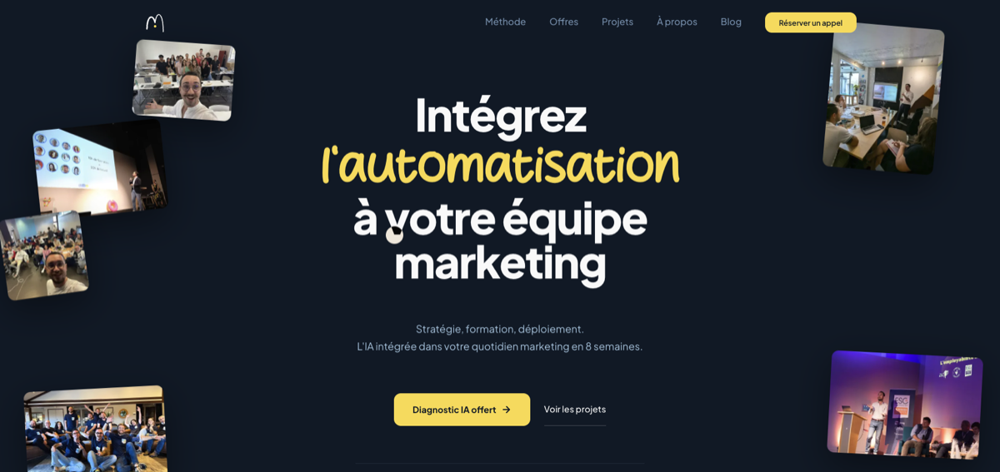 | 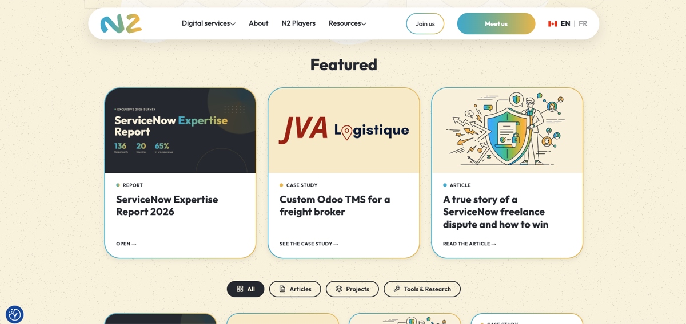 |
| *jessem.fr, the marketing practice this template comes from; the site is written, launched and run with it.* | *N2's resources hub: reports, case studies and articles fed by this cockpit.* |

### Live lead magnets built with this system

Three interactive lead magnets you can open and use right now, each built by the `lead-magnet` skill with its full capture circuit (page → form → nurturing).

| [jessem.fr/diagnostic](https://jessem.fr/diagnostic/) | [jessem.fr/diagnostic-collab](https://jessem.fr/diagnostic-collab/) | [ServiceNow Expertise Report 2026](https://n2.help/tools/servicenow-expertise-report-2026) |
|---|---|---|
| 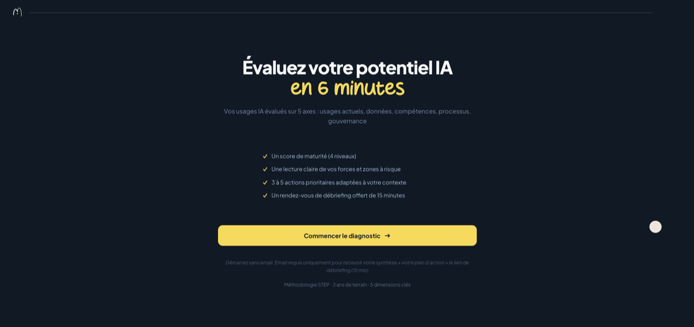 | 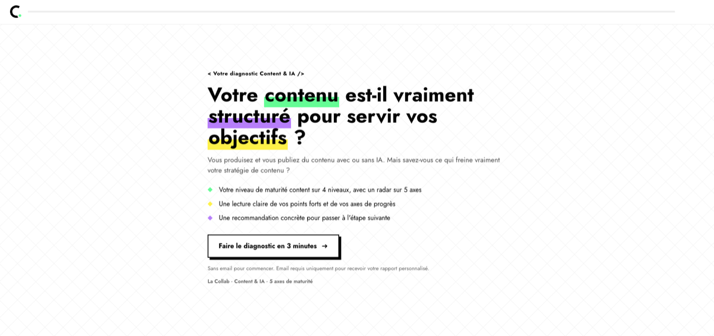 | 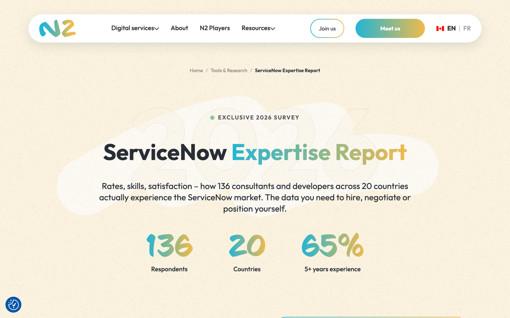 |
| *Interactive marketing diagnostic: the author's own lead magnet.* | *Interactive Content & AI maturity diagnostic ("La Collab").* | *Interactive industry report: 136 respondents across 20 countries.* |

### Real deliverables, shipped

| | | |
|---|---|---|
| 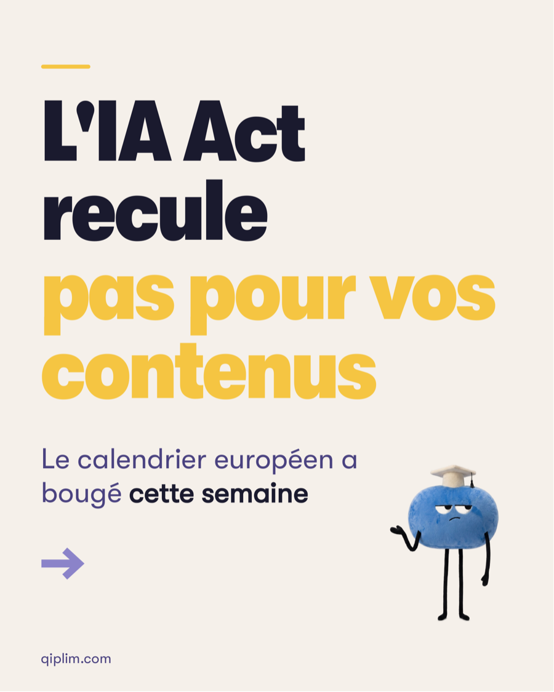 | 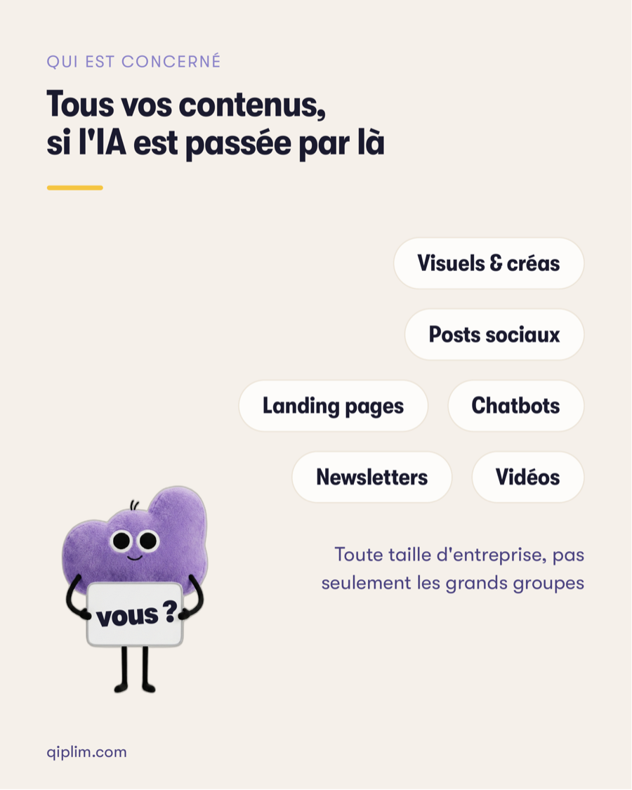 |  |

*Three pages from a real LinkedIn carousel on the EU AI Act (10 pages, 1080×1350 PDF), produced by the `carousel` skill and published in June 2026.*

| | |
|---|---|
| 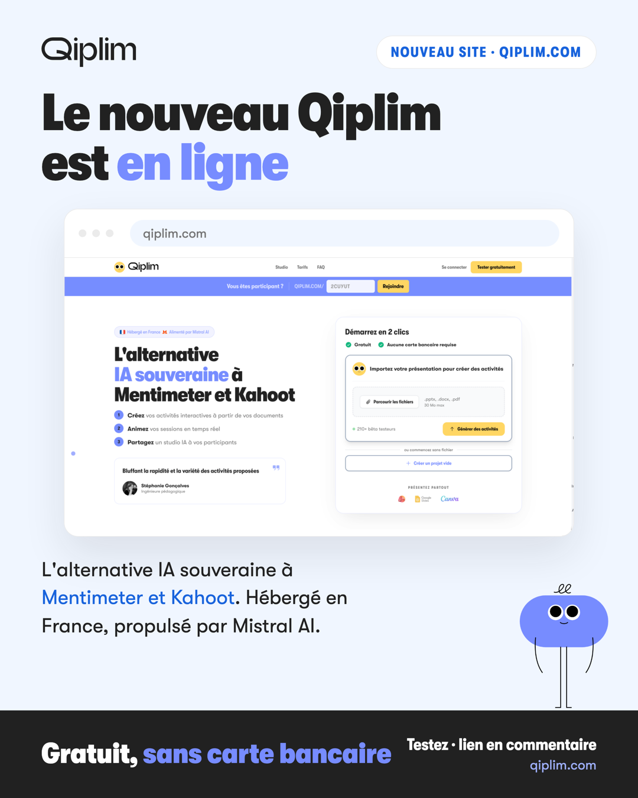 | 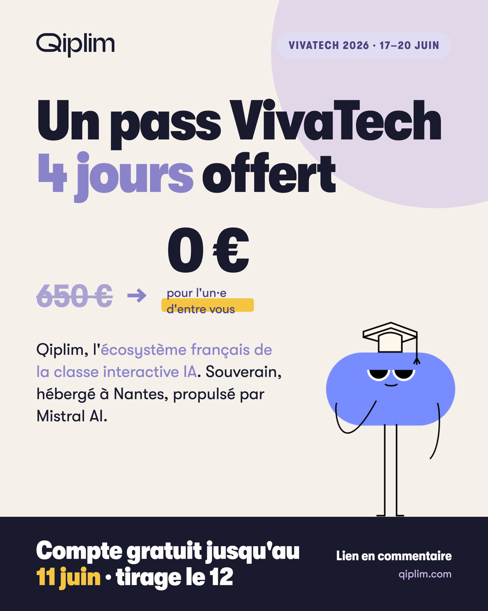 |

*Brand visuals generated by the system (Gemini image pipeline + brand doctrine): LinkedIn post visuals for Qiplim.*

### And it ranks

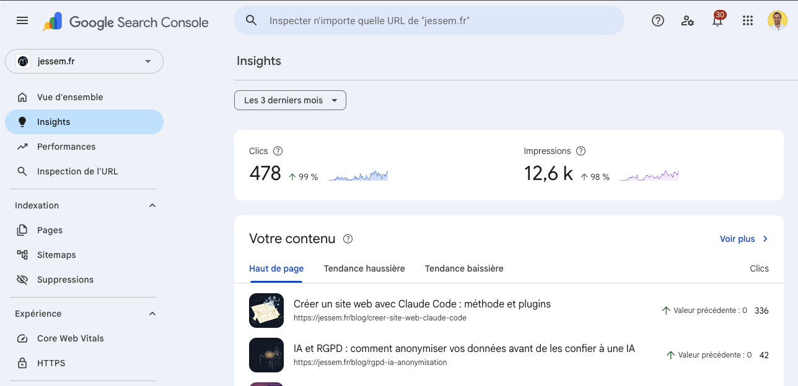
*478 clicks (+99%) and 12.6k impressions in the first 3 months of a freelance marketing site launched with this system, per Google Search Console.*

---

## Why this exists

Generic AI marketing output has a smell. Same adjectives, same em-dash rhythm, same "in today's fast-paced world" openers, and no memory of what you published last Tuesday.

This template is the actual working tool of an externalized marketing practice. It encodes what running AI marketing for real clients forces you to solve:

- **A brand brain as single source of truth**: the four layers above (tokens, voice and blacklist, examples, rights), loaded by every skill *before writing a single word*.
- **Deterministic quality gates**: a PostToolUse hook runs the brand linter and calls the mandatory brand check whenever content lands in a production folder, and measured QA scripts check decks, carousels and visuals before export. The harness enforces the workflow, not the model's goodwill.
- **File-based memory**: an editorial calendar with statuses (`idea → draft → to-validate → validated → published`), per-channel archives and a script-maintained inventory give anti-repetition and auditability with zero external database.

## How it works

```
Core (always on)                          Optional modules (/modules)
┌───────────────────────────────┐         ┌────────────────────────────────────┐
│ 00-intel     field intel      │         │ 08-video            Palmier Pro    │
│ 01-brand     brand brain      │         │ 10-automatisations  n8n engine     │
│ 02-strategy  calendar + KPIs  │────────▶│ 11-reporting        client-site    │
│ 03→07, 09    production roles │         │                     dashboard      │
│ scripts/     brand checks     │         │ 12-acquisition      ads + outbound │
│ wizard + skills + agents      │         │ 14-print            PDF/X-4 CMYK   │
└───────────────────────────────┘         │ + veille, Postiz, client FTP       │
        │                                 └────────────────────────────────────┘
        ▼
 Everything reads 01-brand/ first, and scripts check the result.
```

Four mechanics do the heavy lifting:

1. **A marketing director, not a channel executor.** The root `CLAUDE.md` makes Claude start from the business objective (awareness, leads, conversion, retention), route the request through a routing table to the right skill or agent, and propose an argued channel mix when the ask is vague, instead of replying "which channel do you want?".
2. **The brand brain, read per task.** Each numbered folder is a marketing role with its own `CLAUDE.md` (scope, inputs, workflow, validation gates). Every production skill reads `01-brand/` through its task router before producing anything, and every delivery goes through `brand-check`. Claims without a source in the messaging framework don't ship.
3. **The calendar loop.** Work starts by reading `02-strategy/calendar/calendar.md`, recent intel and `_templates/inventory.md`, and ends by updating entry statuses and indexing the deliverable (`python3 scripts/build-inventory.py --add <path>`). The cockpit knows what was published, what's in review and what's planned, across sessions.
4. **Field intel in.** `00-intel/` (gitignored) holds meeting transcripts and notes, sorted into `interne/`, `clients/`, `prospects/` and `partenaires/` (partners who work with you without buying from you). It is fed by hand, by an n8n workflow (module `automatisations`), or by the Google Drive transcripts feed for Google Workspace teams whose Meet notes are taken by Gemini: an Apps Script exports the Docs to Markdown, `scripts/sync-intel.py` copies only what is new (candidate interviews and accounting meetings never leave the shared drive), and two Monday routines take over. `intel-hebdo` classifies each meeting with a short synthesis; `radar-com` writes the weekly comms radar in `00-intel/radar/` (urgent facts first, 3 to 7 topics, newsletter brief on the first Monday of the month). Setup: [`_integrations/drive-transcripts/README.md`](_integrations/drive-transcripts/README.md) (in French).

## Quickstart

Prerequisites: [Node.js 18+](https://nodejs.org), Python 3.11+ (the brand scripts read TOML with the standard library), and a Claude account (Pro/Max, Team, Enterprise, or an API key) for [Claude Code](https://docs.anthropic.com/en/docs/claude-code/overview).

```bash
# 1. Install Claude Code (once per machine)
npm install -g @anthropic-ai/claude-code

# 2. Clone under a name that makes sense for you (or "Use this template" on GitHub)
git clone https://github.com/Littlpinguin/marketing-cockpit-template.git my-company-cockpit
cd my-company-cockpit

# 3. Create your local env file (filled in later by the wizard)
cp .env.example .env

# 4. Install Python deps
python3 -m pip install pyyaml python-dotenv requests

# 5. Optional: visual QA, carousels and PDF export (Pillow + Playwright)
python3 -m pip install pillow playwright && python3 -m playwright install chromium

# 6. Open Claude Code
claude
```

> **macOS note (PEP 668).** Recent macOS/Homebrew Python installs refuse system-wide `pip install` ("externally managed environment"). Use `python3 -m pip install --user pyyaml python-dotenv requests`, or create a virtualenv first: `python3 -m venv .venv && source .venv/bin/activate`.

Then run the wizard (paste on its own line):

```
/start-cockpit
```

It fetches your website, analyzes your recent content, drafts the four layers of your brand brain for your validation, runs a strategy interview (objectives, channels, personas, customer journey), wires your tools, and hands you a ready cockpit in 30–60 minutes. Enable optional modules any time with `/modules`.

## What's inside

**54 skills**, organized by function (all in `.claude/skills/`):

| Category | Skills | Count |
|---|---|---|
| Writing & editing | `copywriting`, `copy-editing` (7-pass review), `humanize-writing` (anti-AI-tells), `translation`, `social-content`, `email`, `email-deliverability`, `event-marketing` | 8 |
| Design & presentations | `design-system`, `design-direction`, `design-review`, `design-taste`, `design-redesign`, `brandkit`, `image-generation` (generate, then compose real text and logo in HTML; provenance sidecars), `slides` (120-layout HTML decks + Playwright QA), `carousel` (LinkedIn PDF from a JSON spec) | 9 |
| Web & CRO | `landing-page`, `lead-magnet` (with full capture circuit), `cro-page`, `cro-form`, `cro-popup`, `cro-pricing`, `accessibility-web` (WCAG 2.2 AA) | 7 |
| SEO & content engine | `seo`, `seo-audit`, `seo-schema`, `seo-geo` (AI-search/AEO), `seo-cluster`, `blog-engine` (fact-checked articles, ≥90/100 quality gate) | 6 |
| Strategy & intelligence | `content-strategy`, `veille-strategy` (market watch), `scraping`, `performance-report`, `strategy-challenger` (challenge any strategy) | 5 |
| Governance & plumbing | `cockpit-setup` (wizard), `brand-check` (the quality gate, step 0 = brand linter), `inventory` (script-built anti-repetition index), `sync-template`, `backport-to-template` | 5 |
| Paid acquisition | `sea-google-ads`, `ads-audit` (Google/Meta/LinkedIn audit grids, ~157 checks) | 2 |
| Video | `video-editing`, `captions`, `video-generation` (t2v/i2v rushes + text-fidelity check), `video-matting`, `reel-talking-head` (orchestrator, two validation gates) | 5 |
| Automation | `n8n-builder`, `n8n-audit` | 2 |
| Print | `print` (flatplan → grid layout → opaque plate → PDF/X-4 CMYK chain → prepress checks) | 1 |
| Web animation | `animation-gsap` (GSAP + ScrollTrigger), `animation-animejs`, `animation-lottie`, `animation-scroll-reveal` (AOS & co) | 4 |

**20 agents** (`.claude/agents/`): `brand-guardian`, `qa-visuel`, `a11y-auditor`, `seo-technical`, `seo-content`, `seo-google`, `sea-analyst`, `veille-analyst`, `performance-analyst`, `n8n-debugger`, `video-art-director`, `video-model-scout`, `print-preflight`, `print-editorial`, and the six landing agents (`landing-researcher`, `landing-section-builder`, `landing-reviewer-design`, `landing-reviewer-brand`, `landing-reviewer-cro`, `landing-reviewer-a11y`), dispatched in parallel for audits, landing pages and multi-channel campaigns.

**Brand-as-code tooling.** The brand brain's scripts carry no brand value in their code: they read `01-brand/tokens.json` and a TOML config next to them. `build-tokens`, `lint-brand` and `build-inventory` need nothing beyond the Python standard library; tests run with `python3 -m pytest scripts/tests -q` (fictional brand fixtures).

| Tool | What it does |
|---|---|
| `scripts/build-tokens.py` | Generates the brand CSS (the slides engine's brand file, the appendix of `style-guide.md`) from `tokens.json`; targets declared in `build-tokens.toml`; label colours pushed until they reach WCAG 4.5:1; `--check` exits 1 on drift |
| `scripts/lint-brand.py` | Deterministic brand linter, rules and word lists in `lint-brand.toml`; text or JSON output, exit 1 on error; run on every write in a production folder by the PostToolUse hook |
| `scripts/build-inventory.py` | Builds `_templates/inventory.md`, one line per deliverable (date, channel, type, subject, path); `--add` after each delivery, `--check` for drift and undated files |
| `06-graphic-design/scripts/qa-visuel.py` | Measured QA of a carousel, an HTML composition or an image: colour share against the palette, fonts, type floors, WCAG contrast, logo clear space; exit code usable as a gate |
| `06-graphic-design/scripts/build-carousel.py` | LinkedIn carousel engine driven by a `carrousel.json` spec (two families of slide types), exported to PDF by `export-carousel-pdf.py` with gradient text rasterised |
| `06-graphic-design/scripts/compose-screenshot.sh` | The "generate, then compose" pipeline: the model supplies the image, real text, logo and numbers are laid out in HTML on `06-graphic-design/lib/compose.css` (local brand font + tokens), then captured at 2× by headless Chrome |
| `06-graphic-design/scripts/genmeta.py` | Image provenance: real file extension, PNG tag, `<image>.gen.json` sidecar (model, full prompt, inputs, settings, sha256), C2PA guard |
| `06-graphic-design/scripts/promote-asset.py` | Moves a validated asset into `01-brand/assets/` under a conforming name and adds its catalogue entry; refuses it without source, rights and author |
| `06-graphic-design/scripts/new-deck.py` | Creates a deck from the vendored starter with the brand `:root` of `presentations/tokens.css` |
| `scripts/sync-intel.py` | Copies new Drive transcript exports into `00-intel/inbox/`, incremental, with a dry run |
| `scripts/sync-slides-engine.py` | Re-vendors the slides engine from slides-agent; `--check` exits 1 when a vendored file drifted |
| `scripts/relativize-paths.py` | Rewrites machine-absolute paths in HTML/CSS compositions into relative ones |
| `scripts/lint-placeholders.py`, `scripts/dry-run-push.py` | Blocks setup lockdown while `{{…}}` placeholders remain; prints the payload of any push to an external tool before it is sent |

**Working assets, not lorem ipsum:**

- **120 slide layouts** in 8 families (`_examples/deck-catalogue/catalogue.html`, indexed by narrative beat in `LAYOUTS.md`): a self-documenting HTML deck with keyboard nav, grouped overview, fullscreen mode, PDF export with per-character gradient-text rasterization, and automated Playwright QA (engine parity, overflow, ≥18px content and ≥12px labels, brand fonts, contrast AA). The slides engine is vendored from [slides-agent](https://github.com/Littlpinguin/slides-agent) by `scripts/sync-slides-engine.py`; `new-deck.py` starts each deck with your brand tokens.
- **6 landing page templates** (`05-web-content/templates/landing-pages/`), one per archetype (training cohort, long-form online sale, lead magnet, B2B demo, service on quote, event), each a short YAML spec assembled from a **library of 44 landing sections** (`05-web-content/templates/sections/`, all browsable with their usage notes in `catalogue.html`): pinned scroll stories, choice gate and offer recommender, calculator, bundle receipt, review wall, filterable work wall with a document viewer, chapters, margin notes, hand-drawn annotations. One command assembles a single-file, responsive page; another runs the Playwright QA (overflow, type floors, contrast, CTA destinations, tracking). GA4/UTM conventions wired, and a form still pointing to a placeholder endpoint is never counted as a lead.
- **10 interactive lead magnets** (`05-web-content/templates/lead-magnets/`): ROI calculator, diagnostic score, grader, quiz, budget estimator… all with an email capture gate and nurturing segmentation baked in.
- **A client reporting dashboard** (`11-reporting/`): static HTML + monthly JSON snapshots + written analysis, deployed on the client's own site by FTP behind an access code. A demo with 4 months of fictional data (all sources, embedded, opens on double-click) lives in `11-reporting/dashboard/demo/index.html`.
- **Brand doctrine templates** ([`_templates/brand/`](_templates/brand/)): voice, style guide, messaging framework, personas, design tokens, anti-AI writing doctrine, rejection corpus, AI disclosure policy, rights register. The wizard fills them; their method and default rules stay generic.
- **A fictional starter corpus** (`_examples/acme-saas/`) to calibrate tone on day one, and **7 slash commands** (`/start-cockpit`, `/brand-discover`, `/tools-setup`, `/modules`, `/validate-setup`, `/health-check`, `/new-landing`).

## Modules

| Module | What it adds | Prerequisites |
|---|---|---|
| `veille` | Multi-level market watch (competitors, sector, trends) feeding the calendar with **sourced** content ideas | None |
| `video` | AI-assisted editing & captions, AI rushes (t2v/i2v with text-fidelity check), local matting, talking-head reel orchestration, editing doctrine (`08-video/montage.md`) | macOS + [Palmier Pro](https://github.com/palmier-io/palmier-pro); generation needs a multi-model MCP |
| `automatisations` | Build, debug and evolve n8n workflows from Claude (5-phase method, 5,100+ template libraries, `n8n-builder`/`n8n-audit`/`n8n-debugger`); feeds `00-intel/`, watch, reports | Self-hosted n8n (VPS guide included) |
| `reporting` | Brand-styled performance dashboard hosted on the client's site (FTP + access code), monthly snapshots, month-to-month navigation, written analysis | ≥ 1 data source (GA4/GSC, Postiz, email tool) |
| `acquisition` | Outbound campaigns: the cockpit does ICP + brand-voice sequences + lists, [Lemlist MCP](https://developer.lemlist.com/mcp/setup) does sending & deliverability; plus Google Ads operations and multi-platform ads audits | Lemlist account |
| `publication-sociale` | Direct scheduling via [Postiz](https://postiz.com) (open source, self-hostable) | Postiz instance |
| `espace-client` | One password-protected space on your site: dashboard + shared presentations | FTP access |
| `print` | Anything that goes to a printer: two sourced doctrines (editorial layout, prepress), an A5 grid template, an HTML → PDF/X-4 CMYK chain (paper ICC profile, text in pure K, opaque plates instead of transparency) with automated prepress/editorial checks, and two audit agents | Chrome/Chromium, Ghostscript ≥ 10, Python (PyMuPDF, Pillow, numpy), a free ECI ICC profile |

## Why not just ChatGPT? Why not just a template?

Honest answers, because you'll figure them out anyway:

- **vs. a chat session (ChatGPT, Claude.ai, …):** a chat has no filesystem. This repo *is* the memory: brand brain, editorial calendar with statuses, per-channel archives, inventory. The brand gate is a hook and a linter, not a system prompt you hope survives the context window. Deliverables are versioned files (HTML decks, landing pages, dashboards), not text to copy-paste.
- **vs. a prompt pack or a "mega-prompt":** prompts don't ship 120 QA'd slide layouts, a 44-section landing library, 16 working page templates, a brand linter, a dry-run connector layer, or a wizard that regenerates role docs based on the tools you actually use.
- **vs. an agency:** this is an operational framework, not outcomes-as-a-service. It needs your inputs, your validation, and someone who can tell good marketing from bad. It makes a competent operator much faster; it doesn't replace judgment.

**What it is *not*:** not an autopilot (human validation is a designed-in step, sending and scheduling stay manual or go through dry-run gates), not a social scheduler (that's Postiz, optional), and not magic on an empty brand: see ["What good requires"](#what-good-requires).

**One more honest note:** this was built in a French studio. Some internal skill files, script help texts and doctrine templates are written in French (Claude reads them natively, it makes no difference at runtime), which is why some brand-brain files keep French names: `exemples-rejetes.md` (rejected examples), `droits.md` (rights register), `divulgation-ia.md` (AI disclosure). Your cockpit's *output* language is whatever you configure at setup (monolingual or bilingual). Full English-first internals are on the roadmap.

## Data privacy: read this before wiring your CRM

The wizard connects to tools holding customer data (CRM, email marketing, analytics, meeting transcripts). Know your Claude plan before you do:

- **Commercial offerings** (Claude Team, Enterprise, API) do **not** train models on your data; API logs are deleted after 7 days.
- **Consumer plans** (Free/Pro/Max) default to **opt-in for model training**: check your settings before connecting business data.
- **EU data residency** requires Claude via AWS Bedrock (EU inference profiles) or Google Vertex AI (EU endpoints); the direct API has no EU-only option.

References: [Anthropic training policy](https://privacy.claude.com/en/articles/7996868-is-my-data-used-for-model-training) · [Anthropic Trust Center](https://trust.anthropic.com). The wizard repeats this notice (with explicit confirmation) whenever a sensitive connector is configured.

**Security non-negotiables** (full rules in [`SECURITY.md`](SECURITY.md)): secrets in `.env` (scripts) or in the local, untracked `.mcp.json` (MCP servers), both gitignored, never in chat, commits, or any tracked file; `00-intel/` content is never versioned; dry-run before any production push; verify API endpoints; never share transcripts containing client data.

## What "good" requires

This template produces an **operational framework**, not polished marketing on day one. Quality needs: a brand universe (the wizard shapes it with you), some public content to calibrate the voice against, and your real tools wired in. The more honest your inputs, the less generic the output. The brand brain then improves with use: each refusal logged with its reason and each validated asset brings the next draft closer to the brand.

## Standing on the shoulders of giants

The best community skills are **vendored** (copied, adapted, attributed) rather than required as plugin dependencies, so a fork works standalone. Licenses were verified at fetch time; every adapted skill carries an attribution footer, and full provenance registers live in [`docs/vendored-*.md`](docs/):

| Upstream project | Author | What we adapted | License |
|---|---|---|---|
| [claude-seo](https://github.com/AgriciDaniel/claude-seo) | AgriciDaniel | SEO audit, schema, GEO/AEO, clustering skills + 3 SEO agents | MIT |
| [claude-ads](https://github.com/AgriciDaniel/claude-ads) | AgriciDaniel | Multi-platform ads audit (Google/Meta/LinkedIn grids) | MIT |
| [claude-blog](https://github.com/AgriciDaniel/claude-blog) | AgriciDaniel | Fact-checked article engine with a 100-point quality gate | MIT |
| [ui-ux-pro-max](https://github.com/nextlevelbuilder/ui-ux-pro-max-skill) | NextLevelBuilder | Styles/palettes/typography data + UX review grid | MIT |
| [taste-skill](https://github.com/Leonxlnx/taste-skill) | Leonxlnx | Design execution protocol, redesign audit, brandkit | MIT |
| [frontend-design](https://github.com/anthropics/claude-code) | Anthropic | Design direction (intentional, non-templated UI) | Apache-2.0 |
| [marketingskills](https://github.com/coreyhaines31/marketingskills) | Corey Haines | CRO for pages, forms, popups, pricing | MIT |
| [humanize-writing](https://github.com/jpeggdev/humanize-writing) | jpeggdev | 8-pass de-AI-ification + AI-tells reference | MIT |
| [claude-translation-skill](https://github.com/senshinji/claude-translation-skill) | senshinji | Multi-agent translation pipeline with brand glossary | MIT |
| [claudedesignskills](https://github.com/freshtechbro/claudedesignskills) | freshtechbro | Web animation skills (GSAP/ScrollTrigger, Anime.js, Lottie, AOS) | MIT |
| [email-marketing-bible](https://github.com/CosmoBlk/email-marketing-bible) | CosmoBlk | Deliverability triage, compliance table, dark-mode-safe design | MIT |
| [accessibility-agents](https://github.com/Community-Access/accessibility-agents) | Taylor Arndt | WCAG 2.2 AA web referential + a11y audit agent | MIT |
| [slides-agent](https://github.com/Littlpinguin/slides-agent) | Jessy Martin (same author) | The slides engine: starter, components, 120-layout catalogue, QA, PDF export, tests, as a mechanical mirror (`scripts/sync-slides-engine.py`, register `docs/vendored-slides.md`) | MIT |

Each register documents what was kept, what was cut and why, plus a re-sync procedure. If you're an upstream author and want anything changed, open an issue.

## Roadmap

- **English-first internals**: translate the remaining French-language skill files and doctrine templates (output language is already configurable).
- **SEO extensions**: re-vendor `seo-local` / `seo-maps` / `seo-ecommerce` for local and e-commerce use cases (deliberately excluded from core).
- **A/B testing**: an `ab-test-setup` path once a lightweight experimentation harness is chosen.
- **More connectors**: additional email/CRM/analytics targets in `/tools-setup`.
- **More templates**: additional slide families and landing page archetypes.

## Professional installation

This template is the working tool of an externalized marketing & communications practice. If you'd rather have it installed, calibrated on your brand and your team trained on it, Jessy Martin offers a done-for-you setup: [jessem.fr](https://jessem.fr).

## License & usage

MIT, see [`LICENSE`](LICENSE). This is a **template**: hit "Use this template" on GitHub to create your own copy, then adapt it to your brand. Your copy is yours, brand content and all. Found a bug or something misleading? [Open an issue](../../issues).

If this template saves you a hire's worth of grunt work, or just an afternoon, **a ⭐ helps other marketers find it.**
